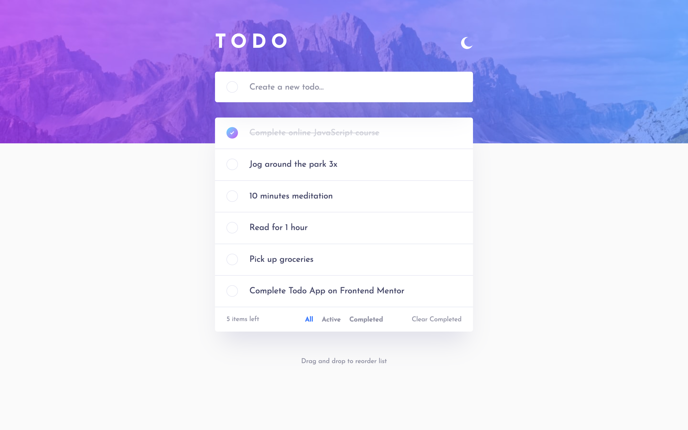

# Todo App

This is a solution to the [todo app challenge on Frontend Mentor](https://www.frontendmentor.io/challenges/todo-app-Su1_KokOW). Frontend Mentor challenges help you improve your coding skills by building realistic projects.

- [The challenge](#the-challenge)
- [Screenshot](#screenshot)
- [Links](#links)
- [Built with](#built-with)
- [Author](#author)

## The challenge

Users should be able to:

- View the optimal layout for the app depending on their device's screen size
- See hover states for all interactive elements on the page
- Add new todos to the list
- Mark todos as complete
- Delete todos from the list
- Filter by all/active/complete todos
- Clear all completed todos
- Toggle light and dark mode
- **Bonus**: Drag and drop to reorder items on the list

## Screenshot

## Links

- [Solution URL](https://github.com/annaindistress/frontend-mentor-todo-app)
- [Live Site URL](https://annaindistress.github.io/frontend-mentor-todo-app/)

## Built with

- Semantic HTML5 markup
- CSS custom properties
- Flexbox
- PostCSS
- Mobile-first workflow
- Vanilla JavaScript
- Vite

## Author

- Frontend Mentor - [@annaindistress](https://www.frontendmentor.io/profile/annaindistress)
- Twitter - [@annaindistress](https://www.twitter.com/annaindistress)
